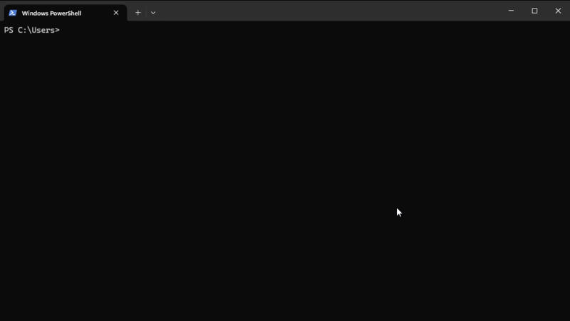

<p align="center">
  <h1 align="center">🟣 plum</h1>
  <p align="center">npm supply chain security scanner — scan before you install.</p>
  <p align="center">
    <a href="https://www.npmjs.com/package/plum-scanner"></a>
    <a href="https://github.com/rjcuff/plum/releases"></a>
    <a href="https://github.com/rjcuff/plum/blob/main/LICENSE"></a>
  </p>
</p>

---

<p align="center">
  
</p>

```
  🟣 plum v0.1.0
  ────────────────────────────────────────
  scanning axios

  pkg axios v1.15.1
    ↓ 99.9M downloads/week

  checks
  ✓  No known CVEs
  ✓  Maintainer (established)
  ✓  Download count healthy

  ────────────────────────────────────────
  score  ██████████████░░░░░░
         70/100 SAFE
  time  0.82s
```

plum scans npm packages for supply chain risks before they touch your project. Version-aware CVE lookups, typosquatting detection, malicious code pattern scanning, and more — all in under a second.

No account. No API key. No workflow change.

## Quick Start

```bash
npm install -g plum-scanner
```

```bash
plum express            # scan a package
plum install express    # scan + install if safe
plum install express -y # auto-approve
```

Also available via curl or as a standalone binary from [Releases](https://github.com/rjcuff/plum/releases):

```bash
curl -fsSL https://raw.githubusercontent.com/rjcuff/plum/main/install.sh | bash
```

## What It Catches

| Signal | Impact |
|--------|--------|
| Known CVEs (version-aware via [OSV](https://osv.dev)) | Hard block or −30 pts |
| Obfuscated `eval(Buffer.from(...))` | Auto block |
| Credential harvesting (`process.env.npm_token`) | −15 pts |
| Shell access via `child_process.exec` | −5 pts |
| Writing to system paths (`/etc/`) | −15 pts |
| Typosquatting (edit distance ≤ 2 from top-200 packages) | −30 pts |
| New maintainer (account < 30 days) | −20 pts |
| Recently published (< 7 days) | −20 pts |
| Install scripts (postinstall/preinstall) | −15 pts |
| Low downloads (< 100/week) | −10 pts |
| No README | −10 pts |

Packages score 0–100. Verdicts: **SAFE**, **RISKY**, or **DANGEROUS**.

## How It Works

1. Resolves the latest (or pinned) version from the npm registry
2. Queries [OSV.dev](https://osv.dev) with the exact version — only CVEs affecting that version are flagged
3. Fetches package metadata: maintainer age, publish date, download count, install scripts
4. Downloads the tarball and scans `.js` files in memory (never written to disk)
5. Checks for typosquatting against the top 200 npm packages
6. Computes a weighted score and renders a verdict

All network requests run in parallel. Typical scan: **< 1 second**.

## Configuration

Drop a `plum.json` in your project root:

```json
{
  "threshold": 70,
  "block_on_cve": true,
  "min_cve_severity": "high",
  "auto_install_above_threshold": false,
  "ignore": ["my-internal-package"]
}
```

| Option | Default | Description |
|--------|---------|-------------|
| `threshold` | `70` | Minimum score to pass |
| `block_on_cve` | `true` | Hard-block when CVEs meet severity threshold |
| `min_cve_severity` | `"high"` | Minimum severity to trigger block (`critical`, `high`, `medium`, `low`) |
| `auto_install_above_threshold` | `false` | Skip prompt if score passes |
| `ignore` | `[]` | Packages to skip |

## Data Sources

| Source | Provides |
|--------|----------|
| [OSV.dev](https://osv.dev) | Version-aware CVE lookups with severity ratings |
| npm Registry | Publish dates, maintainer info, downloads, install scripts |
| GitHub Advisory DB | Known malicious package advisories |
| Tarball analysis | In-memory regex scan of `.js` files for dangerous patterns |

## Build From Source

```bash
git clone https://github.com/rjcuff/plum
cd plum
cargo build --release
```

Requires [Rust](https://rustup.rs/) 1.70+.

## Add the Badge

Show that your project scans dependencies with plum:

```markdown
[](https://github.com/rjcuff/plum)
```

[](https://github.com/rjcuff/plum)

## Why plum

Supply chain attacks happen after `npm install`. plum intercepts before. It's fast, requires no accounts or API keys, and fits into your existing workflow.

Comparable tools like [Socket.dev](https://socket.dev) are SaaS products. plum is open source, CLI-first, and free.

## License

[Elastic License 2.0](./LICENSE) — free to use as a CLI tool, personally and commercially. You may not offer plum as a hosted/managed service without permission. Contributions welcome.
